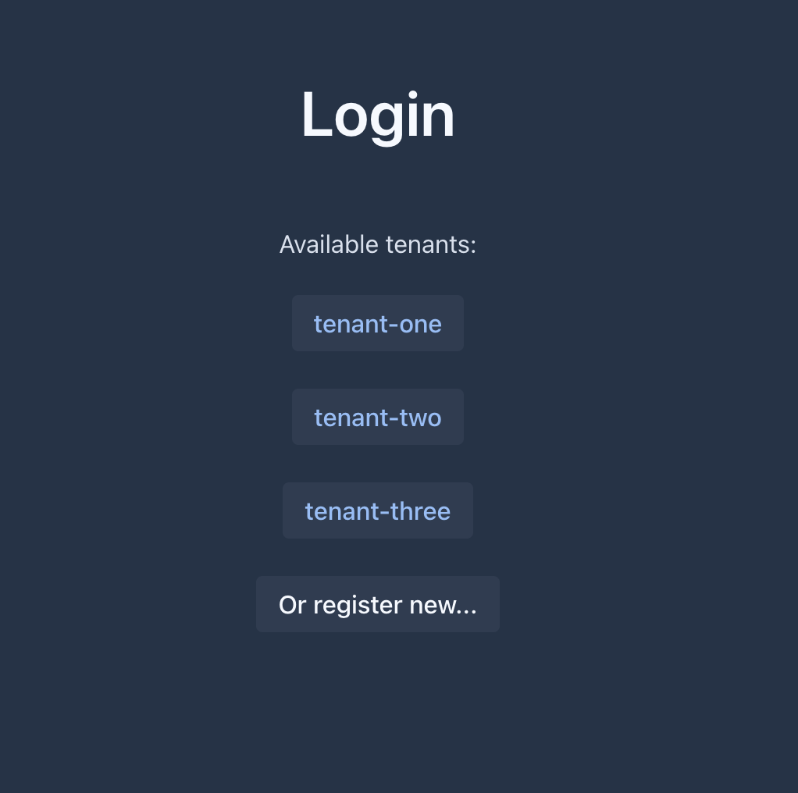
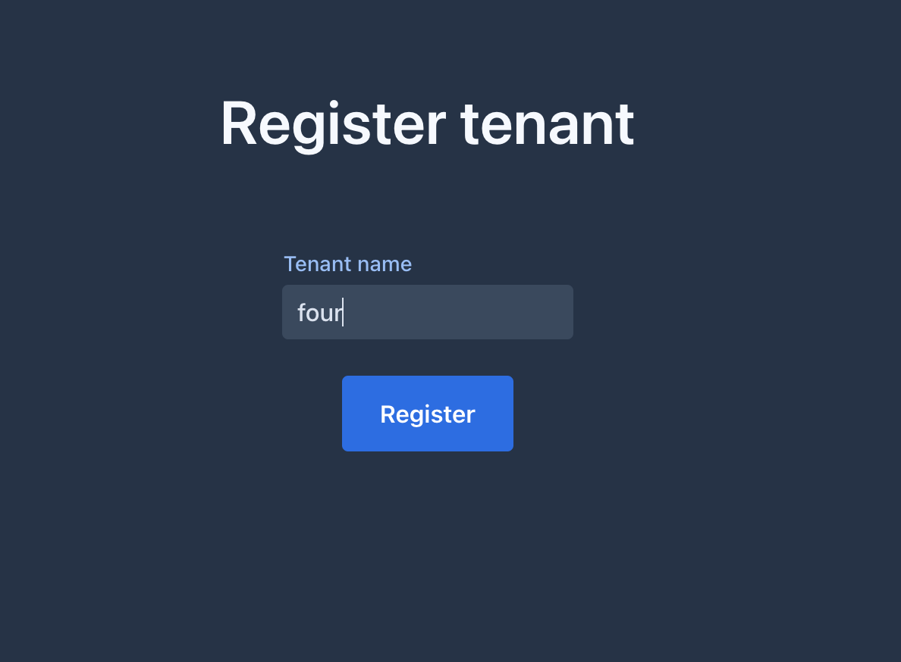
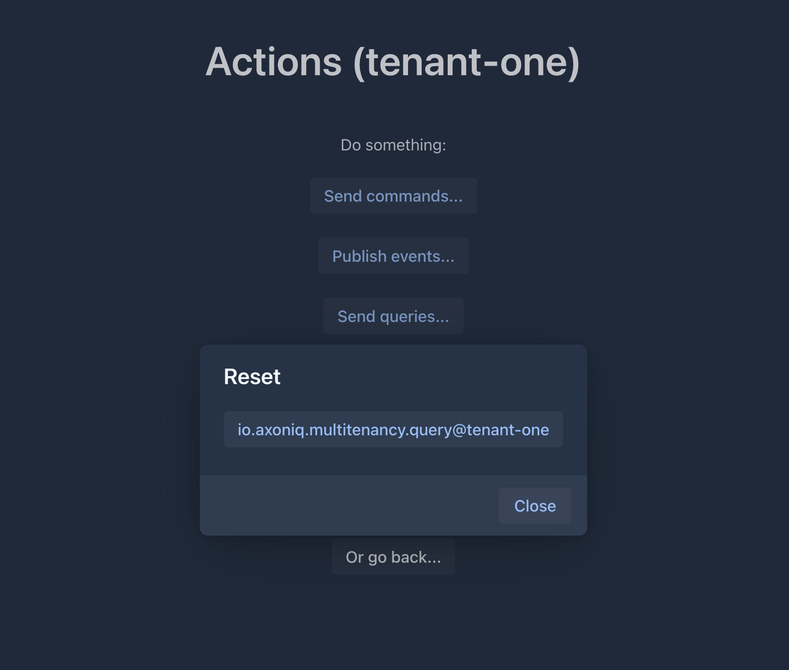
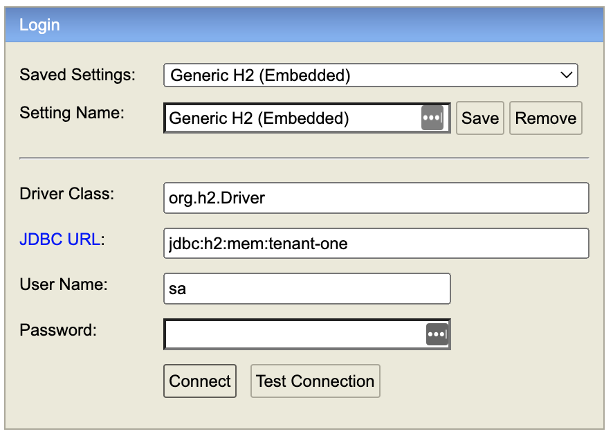

# Multi-tenant playground

This simple app allows you to experiment with multi-tenancy feature in Axon Framework.
By using [Multitenancy extension](https://github.com/AxonFramework/extension-multitenancy) this app can connect to multiple contexts at once dynamicly.
Using Vaadin UI, explore how to create tenants in runtime and dispatch messages to them.

## Requirements
 
 - Requires Axon Server EE 4.6+ (avalible in docker folder) with a valid license
 - Uses In-Memory H2 Database for projections - DB per tenant

## How to start

While in `src/main/docker` type in terminal `docker-compose up` to start Axon Server EE.

Be sure that you have replace content of `axoniq.license` with a valid license.

Start application with `mvn spring-boot:run` or manually via favorite IDE.

After starting application visit and interact with UI at [localhost:8080](http://localhost:8080)

You may start by registering a new tenant.

### With UI you can:
 - Login as existing tenant

 - Register new tenant at runtime
   
 - Send commands, queries, events
   
 - Reset projections

 - Explore H2 Database used for projections - per tenant
 - 

## How it works

### Multi-tenant configuration

[MultiTenantConfig#tenantFilter](src/main/java/io/axoniq/multitenancy/MultiTenantConfig.java) configures application to connect to any context which name starts with `tenant-`.
If new context is created during runtime that matches the filter, application will automatically connect to that tenant.

[MultiTenantConfig#tenantDataSourceResolver](src/main/java/io/axoniq/multitenancy/MultiTenantConfig.java) configures application to use DB for projections per tenant. It defines datasource properties for tenant.
Important: DB needs to be created and schema needs to be initialiesd before context is created, otherwise you will see exception such as DB/Table not found...

[CreateTenantService#createTenant](src/main/java/io/axoniq/multitenancy/web/CreateTenantService.java) uses Admin API to interact with Axon Server and create tenant context.
Before creating context it creates embedded H2 database. As H2 database is in memory, it will not be persistent after application restart, while Axon Server contexts will. 
Be sure to clean up contexts if you are planing to play with this application multiple times or you may expect to see some exceptions.

[MessageService](src/main/java/io/axoniq/multitenancy/web/MessageService.java) routes messages to specific tenant by setting `TENANT_CORRELATION_KEY` MetaData to initial message.

[ResetService](src/main/java/io/axoniq/multitenancy/web/ResetService.java) lists all event processors and resets one for specificity tenant. Convention is that Event Processor name contains original event processor name and tenant name. Such as `even_processor_name@tenant_name`.